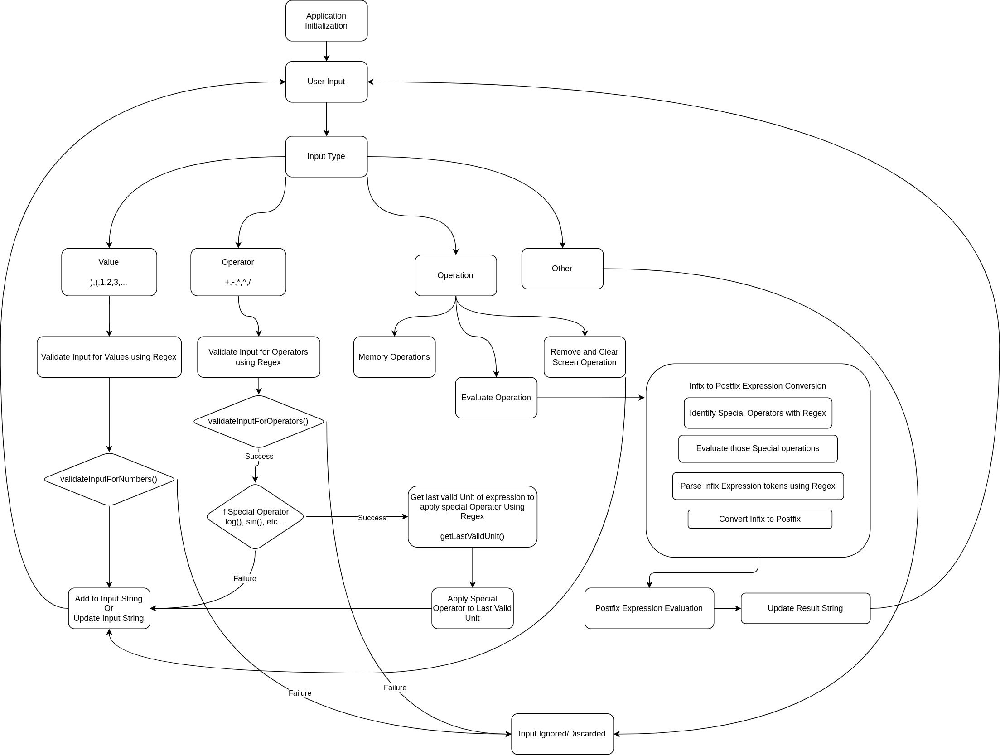

# JS-Assignments

## Assignment1 - Scientific Calculator

### How to Run this Application ?

- Open terminal in Project directory.

- Run `npm install` to install Project Dependencies

- Run `npm run build` to build the Bundle

- Run `npx serve public` to Serve Public Directory and See the output on `http://localhost:3000`

### The flow of Scientific Calculator

